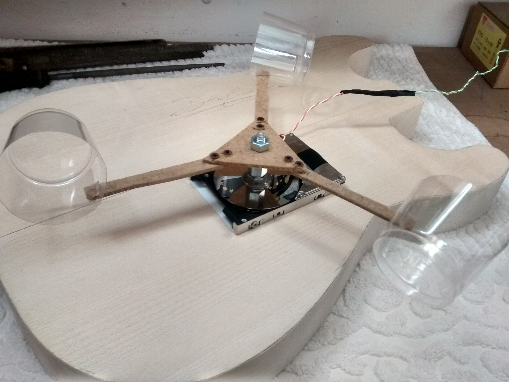

# Arduino anemometer

An anemometer, namely a tool  which can measure wind speed, all built with spare components and powered by an Arduino board. It was developed for school purposes.

## How it works

The script just counts how many turns the anemometer does, then, knowing the length of its arms, it computes wind speed.

## License

This software is licensed under the [Creative Commons Attribution-NonCommercial-ShareAlike 4.0 License](https://creativecommons.org/licenses/by-nc-sa/4.0/). This means that you are allowed to remix, transform, adapt, and build upon the software included in this repository, you can copy and redistribute it in any medium or format, under the following terms:

1. **Attribution** &ndash; you must give appropriate credit, provide a link to the license, and indicate if changes were made. You may do so in any reasonable manner, but not in any way that suggests the licensor endorses you or your use.

2. **NonCommercial** &ndash; you may not use the software included in this repository for commercial purposes.

3. **ShareAlike** &ndash; if you remix, transform, or build upon the software included in this repository, you must distribute your contributions under the same license as the original.

